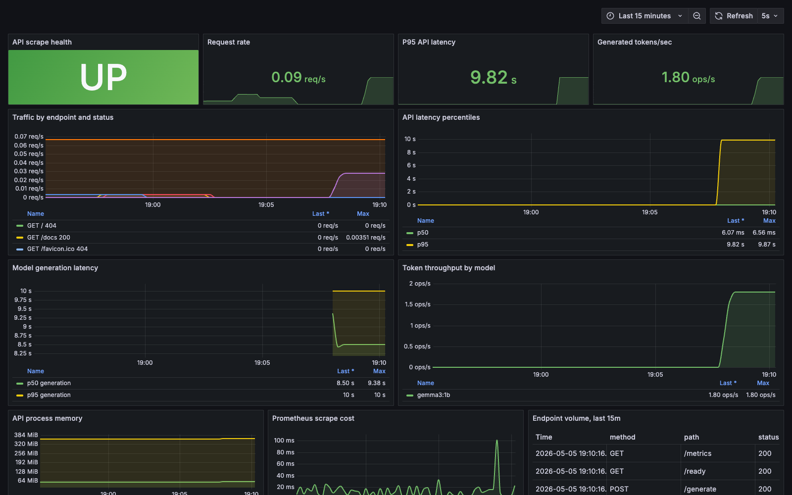

# Gemma AI Infrastructure Lab

[](https://github.com/tedward-23/gemma-local-ai-infra/actions/workflows/ci.yml)

Gemma model serving with a production-style platform around it: a FastAPI inference gateway, Ollama model runtime, Prometheus metrics, Grafana, readiness checks, and a benchmark script.

This is meant to show practical AI infrastructure work, not only a notebook. It demonstrates how a model can be packaged behind an API, observed, benchmarked, and prepared for Kubernetes or a cloud GPU/CPU target.

## Architecture

```text
Client / benchmark script
        |
        v
FastAPI inference API  --->  Prometheus / Grafana
        |
        v
Ollama runtime
        |
        v
Gemma model
```

## What This Shows

- LLM serving with Ollama and Gemma.
- A reusable inference API instead of direct terminal prompts.
- Health and readiness endpoints for deployment environments.
- Prometheus metrics for request volume, latency, and generated tokens.
- CI checks for Python linting, Docker build validation, and container vulnerability scanning.
- A repeatable Docker Compose setup that can evolve into Kubernetes, Terraform, and cloud deployment.

## Run With Docker Compose

Copy the example environment file:

```sh
cp .env.example .env
```

Update `GRAFANA_ADMIN_PASSWORD` in `.env` before starting Grafana.

Start the stack:

```sh
docker compose up --build -d
```

Pull the default Gemma model:

```sh
docker compose run --rm ollama-model-init
```

The default model is [`gemma3:1b`](https://ollama.com/library/gemma3), which Ollama lists as an 815 MB text model with a 32K context window. That keeps the first demo MacBook-friendly. To use a larger model, change `OLLAMA_MODEL` in `.env`.

## Test The API

Check service health:

```sh
curl http://localhost:8000/health
curl http://localhost:8000/ready
```

Generate text:

```sh
curl -X POST http://localhost:8000/generate \
  -H "Content-Type: application/json" \
  -d '{"prompt":"Explain AI model serving in three concise bullets.","max_tokens":128}'
```

Run a small benchmark:

```sh
python3 scripts/benchmark.py --requests 10 --concurrency 2
```

## Development URLs

- API docs: http://localhost:8000/docs
- API metrics: http://localhost:8000/metrics
- Prometheus: http://localhost:9090
- Grafana: http://localhost:3000

Grafana uses `GRAFANA_ADMIN_USER` and `GRAFANA_ADMIN_PASSWORD` from your `.env` file. Do not reuse the example password outside development.

## Monitoring Dashboard

The repository includes a provisioned Grafana dashboard for the AI serving stack:

- API scrape health and request rate.
- API p50/p95 latency.
- Model generation p50/p95 latency.
- Generated token throughput.
- Endpoint volume by method, path, and status.
- API memory pressure and Prometheus scrape cost.



## Engineering Focus

This project demonstrates a practical AI serving workflow with reproducible containers, health checks, observability, benchmarking, and deployment-ready service boundaries.

## Next Improvements

- Add Kubernetes manifests or a Helm chart.
- Add Terraform for cloud deployment.
- Add OpenTelemetry traces.
- Add model evaluation prompts and regression tests.
- Add GPU profile support for cloud or workstation acceleration.
